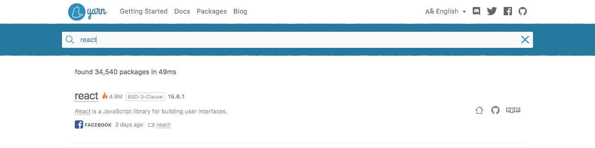

# Package Management with ~~NPM~~ [YARN](https://yarnpkg.com/en/docs/cli/add)

### Objectives
- Manage package versions
- Explain dependency versioning
- Explain npm, yarn, and its purpose
- Update packages and change node version based on work environment

## The Problem At Hand

As we develop our own node apps we will find ourselves implementing third-party modules to help us with a wide range of tasks. These modules, which are commonly referred to as node packages or dependencies, are maintained by various developers and can be viewed as living and breathing mini-applications.

The reason we view node packages as living entities is because the code that they consist of often changes. Sometimes bugs are found so fixes must be made to code or extra features are added to a package also creating new code. Changes like these can cause shifts in the way a package must be implemented. These changes are often referred to as "breaking changes"; meaning, if we don't change how our own application integrates the third-party package, our app will break. This lesson will focus on how to best manage your node packages and overall node applications so that you can avoid issues related to your packages.

## NPM Intro - (5 mins)

When you first went nodejs.org to download node, you may or may not have known that you were also downloading npm. npm is node's package manager that that comes bundled with the installation of node.js.

npm is functions as two things, primarily:

- an online repository containing published open-source, and as of somewhat recently private, node packages
- a command-line utility for interacting with the npm repository aiding in:
    - package installation
    - version management
    - dependency management
    - built-in as well as custom scripts

***tip:*** To find out which version of npm you have, run the command `npm -v`. To find out which version of node you're using, run the command `node --version`.

## [Yarn](https://yarnpkg.com/en/) Intro

As the global tech community used npm extensively, many found npm to be unreliable in terms of installation and download. Enter `yarn`; this open source project is a collaboration between Facebook, Exponent, Google, and Tilde that tries to address this problems.

It promised reliability, security, usability and most importantly speed. To install `yarn`, run this command:

```
npm install --global yarn

// followed by (MacOS & Ubuntu)
export PATH="$PATH:`yarn global bin`"
```

***tip:*** make sure yarn is installed by running `yarn --version`.

## ~~NPM~~ YARN as a Repository - Demo (10 mins)

Let's cover the first point. `yarn` can be thought of as a GitHub, of sort, as in it is an online repository containing thousands of node libraries and applications. If you know the name of the node package you'd like to use, a good way to find its docs would be to search for it at [https://yarnpkg.com/](https://yarnpkg.com/en/).



However, if you're not sure of the module name your application needs help from, the best way to find what you're looking for is with a simple Google search with the keywords `yarn `followed by a short query describing what you're trying to do.


More often than not, the package you need will pop up in the first page of results, if not the very first result.

## Package Installation

As mentioned, `yarn` is also an extremely powerful command-line tool that allows us to communicate with the npm repository. For example, if you wanted to download the `react` package into your application, you would run the command `yarn add react`. `yarn add <package name>` is the command format for _local_ installation. When a local installation occurs, `yarn` installs the specified package into a `node_modules` folder located in the root of your node application's folder. If no `node_modules` folder is present - like when you're installing the app's first third-party package - one will be automatically generated. By default, `yarn` will perform local installations.

However, there are times when you need to install a package globally. Perhaps the package you want to use offers a task runner or a background [daemon](https://en.wikipedia.org/wiki/Daemon_(computing)) that is not meant to be used solely for a specific app but instead as a tool to help with the development of all your apps. These types of packages often come with a command line interface (CLI) which means they must be installed in your system directory, a.k.a. globally. In order to install a package globally, you just need to add `global`, in your installation command. For example, if you were to install nodemon, a background daemon, you would run the command `yarn add *global* nodemon`.


To quickly summarize, you locally install a package when you its purpose is app specific, and you globally install a package when its purpose is app-agnostic.


### Installing nodemon
```bash
yarn global add nodemon
```

If we just ran `node nameOfFile.js`, node will not update if we make changes to the file. Nodemon solves this problem by updating the file once changes have been made. Install nodemon (only have to do this once), we will run our apps using the syntax

```bash
nodemon nameOfFile.js
```

## Package.json

At this point, you may be asking yourself a very important question: how does `yarn` know I have a node app that will accept installed packages?! The answer is `package.json`.

The `package.json` file contains various metadata relevant to your application and most importantly, it gives `yarn` information that allows it to identify your app.

Here's an example of a `package.json`:

```
{
  "name" : "underscore",
  "description" : "JavaScript's functional programming helper library.",
  "homepage" : "http://documentcloud.github.com/underscore/",
  "keywords" : ["util", "functional", "server", "client", "browser"],
  "author" : "Jeremy Ashkenas <jeremy@documentcloud.org>",
  "contributors" : [],
  "dependencies" : [],
  "repository" : {"type": "git", "url": "git://github.com/documentcloud/underscore.git"},
  "main" : "underscore.js",
  "version" : "1.1.6"
}
```

Note all the metadata attributes of the file (these are just *some* attributes):

- name: name of the package
- version: version of the package
- description: description of the package
- homepage: homepage of the package
- author: author of the package
- contributors: name of the contributors of the package
- dependencies: list of all the third-party packages (dependencies) the package has installed
- repository: repository type and url of the package
- main: entry point of the package

Out of all these pieces of data, only two are required for `yarn` to recognize your app: name and version. As long as you have those two pieces of information, `yarn` will be able to locate your app when installing packages into your app's `node_modules` folder.

This file also serves as a documentation of your application for other developers to use. Your description can give anyone a quick idea on the purpose of your package and just by skimming your listed dependencies, a fellow developer can quickly see what your app depends on.

In terms of your application dependencies, when working with a team of developers, it is common practice to put `node_modules/*` in your `.gitignore` file. As long as your dependencies are listed in the package.json, a teammate can run `yarn install` after cloning your app and have all the listed dependencies installed locally!

<!-- ***tip:*** Running `yarn add <package name>` will install the package into your `node_modules` folder but will not automatically add the package as a dependency in your package.json. In order to do so, add the `--save` option to the command (i.e. `npm i --save express`). -->

## Start a fresh node project

There are two main ways you can start a node project, by setting it up yourself, or by using other developers' setting. By running `yarn install`, we are essentially running a project with other developer' setting, like stealing a recipe from a cookbook.


So how do we start our own node project? To do so you need a blank directory and create your own `package.json` file. Thankfully you don't have to write it from scratch.

```
// first thing first, create the blank directory
mkdir my_first_node

// cd into the node, and run the init command
cd my_first_node
yarn init
```

You will then be asked by `yarn` a couple of questions related to your project. Answer those questions accordingly _(no answers are usually okay at this stage)_.


and **voila!** You have created your first node project.

## Version Management

But how do we know what version of a package we are using? We do want to avoid those "breaking changes" mentioned earlier after all. Let's take a look at a dependencies attribute in a package.json file that has been given a value.

```json
...
  "dependencies": {
    "accepts": "~1.2.3",
    "content-disposition": "0.5.0",
    "cookie-signature": "1.0.5"
  }
...
```

Each listed dependency has a specified version associated with it, so that we may know what exactly we're working with. There are various ways a dependency version can be declared, and these version values often come with some interesting characters (`~`, `^`, etc.). Here's a chart to help break things down:

| Version Number | Explanation |
| -------------- | ----------- |
| latest | Takes the latest version possible. Not the safest thing to use. |
| 4, 4.*, 4.x, ~4, ^4 | Any version that starts with 4. Takes the latest. |
| >4.8.5 | Choose any version greater than a specific version. Could break your application. |
| <4.8.5 | Choose any version lower than a specific version. |
| >=4.8.5 | Anything greater than or equal to a specific version. |
| <=4.8.5 | Anything less than or equal to. |
| 4.8.3 - 4.8.5 | Anything within a range of versions. The equivalent of >=4.8.3 and <=4.8.5 |
| ~4.8.5 | Any version “reasonably close to 4.8.5″. This will call use all versions up to, but less than 4.9.0 |
| ~4.8 | Any version that starts with 4.8 |
| ^4.8.5 | Any version “compatible with 4.8.5″. This will call versions up to the next major version like 5.0.0. Could break your application if there are major differences in the next major version. |
| ^1.2 | Any version compatible with 1.2 |

Now when working with a team if you ever encounter a scenario where a package may be behaving differently for different developers, you know to check the dependency versions in the `package.json` files. Also, when updating a package you should check to see if there are any breaking changes mentioned in the version documentation.

#### Updating a package

Did someone mention updating a package? To update a package you simply run the command `yarn update <package name>`. Pretty intuitive, eh?

***note:*** Not all dependencies we use are used by the application in production. Whenever we need a dependency that will only be used in our development environment, say a package that helps with js linting, we will add that dependency to a `devDependencies` attribute in our package.json. This type of installation can be done with the command `yarn add <package name> --dev`.

## Using .gitignore
Node will install many large files to the `node_modules` folder. We don't want nor need to push these to our GitHub repo! Whoever takes our project can run `yarn install` after cloning our repo and run with it. So what can we do?

We can make use of a hidden file called .gitignore - inside which we specify what files and folders we would like Git to not track and hence, not push to GitHub.

#### 2 ways to do gitignore

The first way is to create a new repo on GitHub and choose from the dropdown menu what you'd like to ignore. This can be found just before the "Create repository" button - just choose "Node".

The second, slightly more troublesome way is to create your own gitignore file on your local machine. In your project directory on Terminal:
- run `touch .gitignore`
- open .gitignore on your editor, add `node_modules` in a new line
- run your standard git add and commit
- when you push to your remote GitHub repo, `node_modules` will not be pushed

## Review
Test your understanding of the lesson:

- Explain the term "breaking changes" and its cause.
- What is npm, yarn and its purpose?
- What is the purpose of the package.json file?

## Useful links

- [npm vs yarn cheat sheet](https://shift.infinite.red/npm-vs-yarn-cheat-sheet-8755b092e5cc)
- [yarn installation guide](https://yarnpkg.com/en/docs/install)
- [yarn cli cheat sheet](https://yarnpkg.com/en/docs/cli/)
